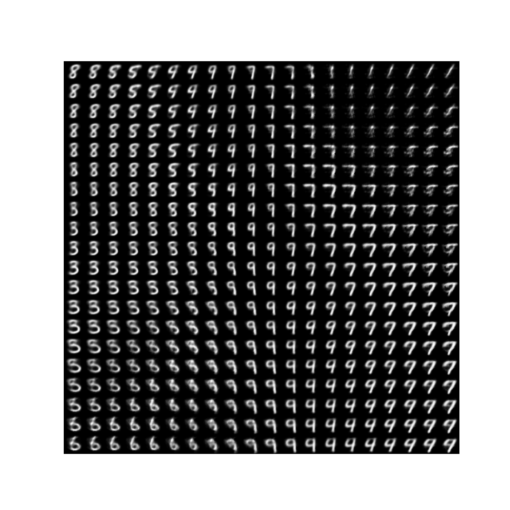

## Autoencoders and more

To learn something about autoencoding I have followed  [this youtube tutorial](https://www.youtube.com/watch?v=p7yUWIySj8o).

An autoencoder is a type of artificial neural network used to learn efficient codings of unlabeled data (unsupervised learning). An autoencoder learns two functions: an encoding function that transforms the input data, and a decoding function that recreates the input data from the encoded representation. The autoencoder learns an efficient representation (encoding) for a set of data, typically for dimensionality reduction, to generate lower-dimensional embeddings for subsequent use by other machine learning algorithms.

### A very simple autoencoder

In an autoencoder two parts need to be present, the encoder.
```
self.encoder=nn.Sequential(
            nn.Linear(32*32,128),
            nn.ReLU(),
            nn.Linear(128, 64),
            nn.ReLU(),
            nn.Linear(64,32),
            nn.ReLU(),
            nn.Linear(32,bottleneck_size)
        )
```

And the decoder. The decoder typically is the opposite of the encoder.

```
self.decoder = nn.Sequential(
            nn.Linear(bottleneck_size, 32),
            nn.ReLU(),
            nn.Linear(32, 64),
            nn.ReLU(),
            nn.Linear(64, 128),
            nn.ReLU(),
            nn.Linear(128, 32*32),
            nn.Sigmoid()
        )
```

In this case the MNIST-dataset will be used. This dataset contains images of numerical digits. As this is an image dataset a convolutional auto-encoder will be more succesful.

### A convolutional autoencoder

In a convolutional autoencoder the encoder looks like this.

```
self.encoder_conv = nn.Sequential(
            nn.Conv2d(in_channels=in_channels, out_channels=8, kernel_size=3, stride=2, padding=1, bias=False),
            nn.BatchNorm2d(8),
            nn.ReLU(),
            nn.Conv2d(in_channels=8, out_channels=16, kernel_size=3, stride=2, padding=1, bias=False),
            nn.BatchNorm2d(16),
            nn.ReLU(),
            nn.Conv2d(in_channels=16, out_channels=self.bottleneck, kernel_size=3, stride=2, padding=1),
        )
```

And the decoder.

```
self.decoder_conv = nn.Sequential(
            nn.ConvTranspose2d(in_channels=self.bottleneck, out_channels=16, kernel_size=3, stride=2, padding=1,
                               output_padding=1),
            nn.BatchNorm2d(16),
            nn.ReLU(),
            nn.ConvTranspose2d(in_channels=16, out_channels=8, kernel_size=3, stride=2, padding=1, output_padding=1),
            nn.BatchNorm2d(8),
            nn.ReLU(),
            nn.ConvTranspose2d(in_channels=8, out_channels=in_channels, kernel_size=3, stride=2, padding=1,
                               output_padding=1),
            nn.Sigmoid()
        )
```

Using the decoder and the encoder information can be encoded or decoded. After decoding the information should be almost identical to the information being encoded.

Loss is the difference between the original image and the decoded or reconstructed image. In this case the mean is taken, as images of 32*32 tend to have to big loss values.

```loss = torch.mean((images - reconstruction) ** 2)```

### Compare results of autoencoders with the original image

The difference for both encoders compared to the original image for an example is visible below.


### Autoencoder embeddings

As the autoencoder compresses data to two dimensions it is fairly simple to visualize it.


### PCA and autoencoders

The whole idea of compression -representing data with the least possible features- is comparable with the idea of principal component analysis (PCA).

The PCA plot for a part of the MNIST dataset projected to two dimensions is very comparable to the plot for the autoencoder that reduces MNIST-data to two dimensions.


### t-SNE

t-SNE (t-distributed Stochastic Neighbor Embedding) is an unsupervised non-linear dimensionality reduction technique for data exploration and visualizing high-dimensional data. Non-linear dimensionality reduction means that the algorithm allows us to separate data that cannot be separated by a straight line.


The convolutional encoder shows a very good separation between classes.

### Generating from the embeddings

The autoencoder can serve as a generative model, when calculating the median for every embedded dimension, grouped by the class (0-9) and putiing this data in the decoder part of the model, reconstructed images look like below.

Numbers 4 and 5 are bit unclear.


### Interpolating




